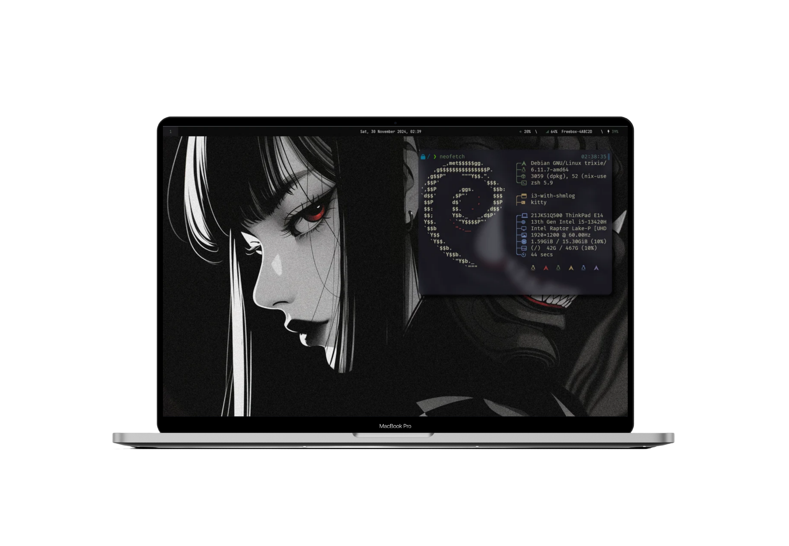
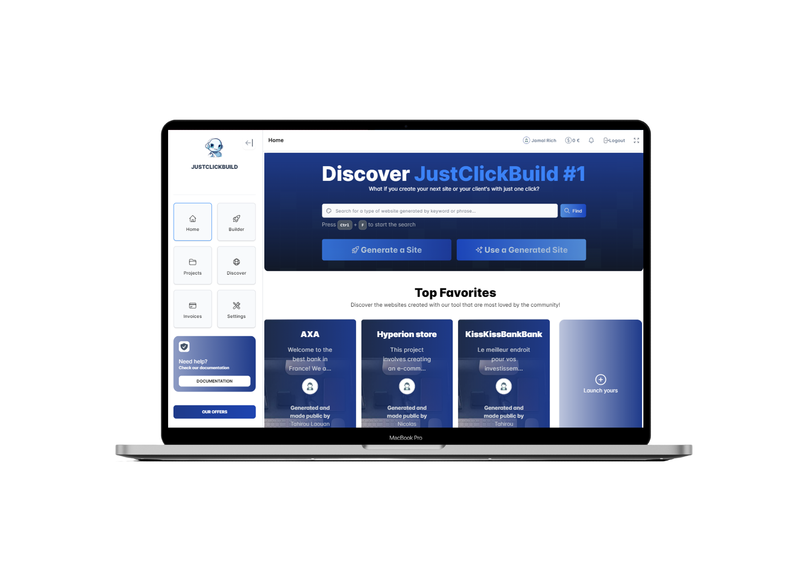

- Stuying software engineering at Epita Paris
- Currently working for Enedis
- Productivity maxxing
- Finance enjoyer

<h2 align="left" id="macropower-tech">Favorite Tech</h2>

<blockquote>Tools</blockquote>
<table>
  <tr>
    <td align="center" width="96">
        
       &nbsp;&nbsp;&nbsp;&nbsp;Git&nbsp;&nbsp;&nbsp;&nbsp;&nbsp;
    </td>
    <td align="center" width="96">
        
       &nbsp;&nbsp;Linux&nbsp;&nbsp;&nbsp;
    </td>
    <td align="center" width="96">
        
       &nbsp;&nbsp;&nbsp;Neovim&nbsp;&nbsp;&nbsp;
    </td>
    <td align="center" width="96">
        
       &nbsp;&nbsp;I3WM&nbsp;&nbsp;&nbsp;
    </td>
    <td align="center" width="96">
        
       Notion
    </td>
    <td align="center" width="96">
        
       &nbsp;&nbsp;Obsidian&nbsp;&nbsp;&nbsp;
    </td>
  </tr>
</table>

<blockquote>Languages and Frameworks</blockquote>
<table>
  <tr>
    <td align="center" width="96">
        
       &nbsp;&nbsp;&nbsp;&nbsp;C&nbsp;&nbsp;&nbsp;&nbsp;&nbsp;
    </td>
    <td align="center" width="96">
        
       Python
    </td>
    <td align="center" width="96">
        
       Django
    </td>
    <td align="center" width="96">
        
       PostgreSQL
    </td>
    <td align="center" width="96">
        
       Laravel
    </td>
    <td align="center" width="96">
        
       Flask
    </td>
    <td align="center" width="96">
        
       JavaScript
    </td>
    <td align="center" width="96">
        
       TailwindCSS
    </td>
  </tr>
</table>

## Projects Overview

> Some of my favorite projects.
<table>
  <tr>
    <td align="center" width="50%"><a href="https://github.com/Juicyyyyyyy/dotfiles">💻 Dotfiles (2024-Now)</a></td>
    <td align="center" width="50%"><a href="https://pomopensource.com/">🍅 Pomopensource (2024-2025)</a></td>
  </tr>
  <tr>
    <td>My personal reproducible Linux productivity-optimized workstation</a>.
</td>
    <td>A minimalist and customizable webapp providing statistics on how much time you worked and on which subject. </td>
  </tr>
  <tr>
    <td></td>
    <td></td>
  </tr>
</table>
<table>
  <tr>
    <td align="center" width="50%"><a href="https://justclickbuild.com">🤖 Multi Page Website Generator (2023-Now)</a></td>
    <td align="center" width="50%"><a href="https://github.com/Juicyyyyyyy/portfolio_optimizer">💰 Portfolio Optimizer (2024)</a></td>
  </tr>
  <tr>
    <td>A for-profit multi-page website generator based on artificial intelligence. Co-created with Tahirou Laouan Magagi. Try it now on <a href="http://justclickbuild.com">justclickbuild.com</a>.
</td>
    <td>A user-friendly financial portfolio optimization tool simplified through the integration of AI. Based on the research of Nobel Prize-winning economists.</td>
  </tr>
  <tr>
    <td></td>
    <td></td>
  </tr>
</table>
<table>
  <tr>
    <td align="center" width="50%"><a href="https://www.tradingview.com/script/EKlYtPwv/">📊 Multi Indicators Table (2023)</a></td>
    <td align="center" width="50%"><a href="https://github.com/Juicyyyyyyy/component_generator">🤖 Component Generator (2024)</a></td>
  </tr>
  <tr>
    <td>A trading tool that presents an overview of the market in a tabular format using multiple categories of trading indicators. The indicator obtained more than 400 likes on TradingView. 
</td>
    <td>A Tailwind CSS component generator based on artificial intelligence.</td>
  </tr>
  <tr>
    <td></td>
    <td></td>
  </tr>
</table>

<table>
  <tr>
    <td align="center" width="50%"><a href="https://corentindupaigne.herokuapp.com">💼 Personal Portfolio (2023)</a></td>
    <td align="center" width="50%"><a href="https://www.tradingview.com/script/R12WO2J5-TrendVista-Swing-Indicator/">📊 TrendVista Swing Indicator (2024)</a></td>
  </tr>
  <tr>
    <td>My personal portfolio, which I invite you to visit to learn more about my skills, achievements, and professional experiences.
</td>
    <td>A trading tool based on bollinger bands and average true range giving buy/sell signals on key levels.</td>
  </tr>
  <tr>
    <td></td>
    <td></td>
  </tr>
</table>
